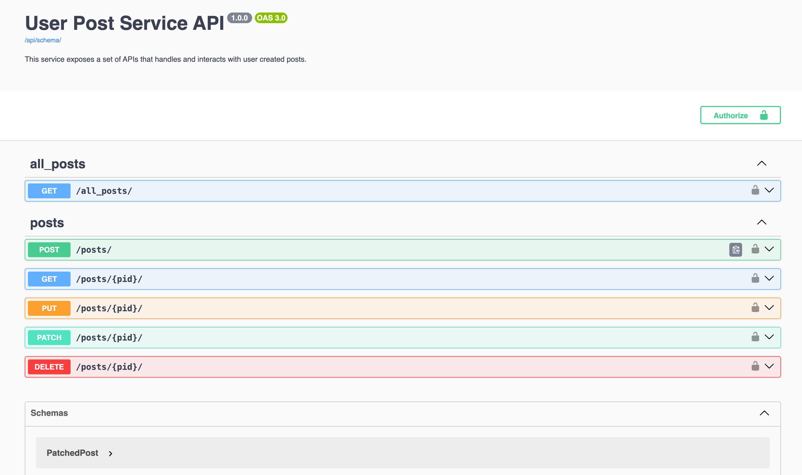

# User Post Microservice

This microservice handles user posts (textual data) for the Columbia Online Social Platform project.

## Usage

To connect with a remote MySQL server on AWS, create a `my.cnf` file in the root directory, which should look like:

```
[client]
database=your_database_name    # The name of the remote database you're connecting to
user=your_username             # The username for your remote MySQL instance
password=your_password         # The password for your MySQL user
host=remote_server_ip          # The IP address or hostname of the remote MySQL server
port=3306    
```

Start the server using:
`python manage.py runserver [PORT]`

To sync with the database after updating data models in `models.py`, run
```
python manage.py makemigrations
python manage.py migrate
```


## Deployment

The service is deployed directly to an AWS EC2 instance.

Steps to take on the VM instance:
1. Add instance IP to `ALLOWED_HOSTS` in `settings.py`
2. Run `pip install -r requirements.txt` to install all dependencies
3. Copy over the `my.cnf` credentials
4. Start the server: `gunicorn blog4153.wsgi --bind 0.0.0.0:8000`

The URL address is (this might change after restarting the instance)

```
http://184.72.105.29:8000
```


## API Endpoints

Please see the OpenAPI documentation by visiting the `{BASE_URL}/api/docs` endpoint.



### Create Post

- **Endpoint**: `/posts/`
- **Method**: `POST`
- **Description**: Creates a new post with the provided title and content.
- **Request Body**:
    - `title` (string): The title of the post.
    - `content` (string): The content of the post.
    - `image_object_name` (string): The object name stored in the S3 bucket.


### Get Post

- **Endpoint**: `/posts/<int:pid>/`
- **Method**: `GET`

### Get All Posts

- **Endpoint**: `/all_posts/`
- **Method**: `GET`


### Put Post

- **Endpoint**: `/posts/<int:pid>/`
- **Method**: `PUT`
- **Request Body**:
    - `title` (string): The title of the post.
    - `content` (string): The content of the post.
    - `image_object_name` (string): The object name stored in the S3 bucket.

### Delete Post

- **Endpoint**: `/posts/<int:pid>/`
- **Method**: `DELETE`
